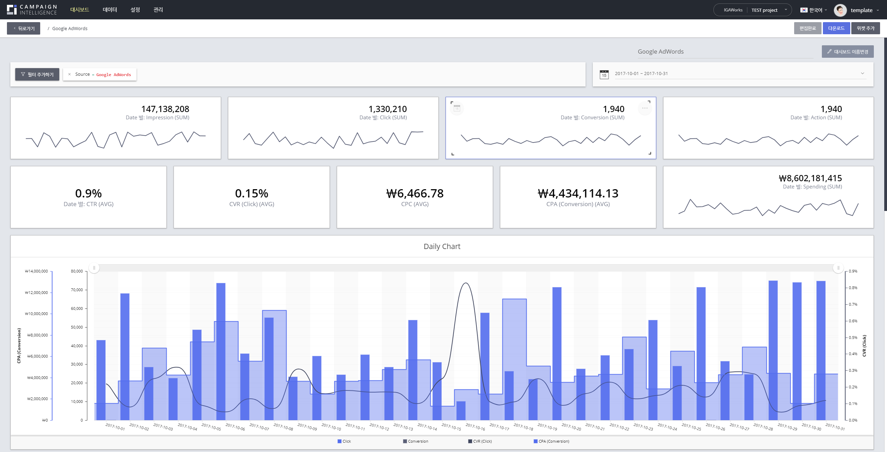
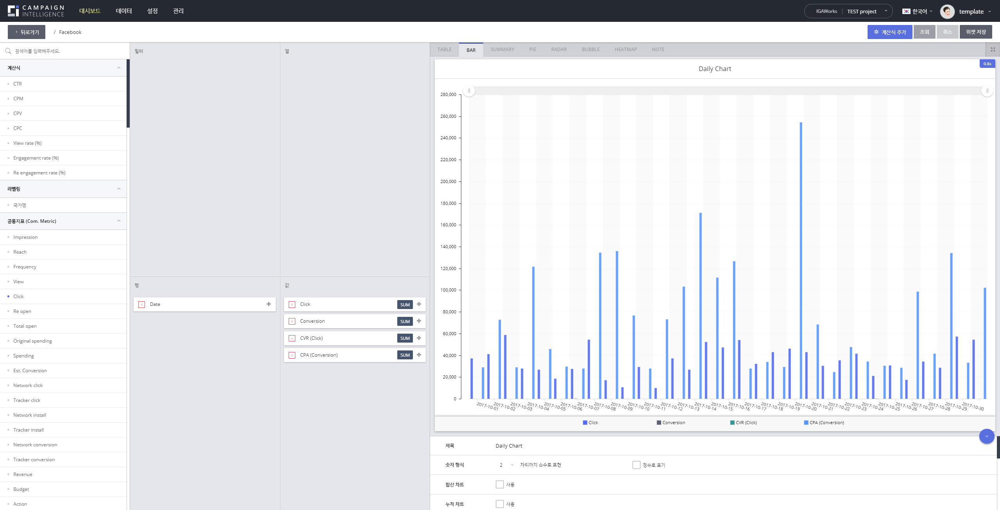

## Campaign Intelligence 개발자를 구합니다!

AdTech 분야의 중심점, **Campaign Intelligence** 팀에서 서버/웹 개발자를 채용합니다!

### 무엇을 하는 팀인가요?

안녕하세요! IGAWorks의 [Campaign Intelligence](https://c-intelligence.com/main)는 매체 리포팅, 어트리뷰션 등의 수많은 벤더에서 제공하는 데이터를 정제/가공하여 고객사에게 애드테크 업계의 심도 있는 인사이트를 제공하는 팀입니다.

_-사용자가 대시보드를 직접 만들고 공유할 수 있어요!_

_-위젯별로 Visualization을 위한 다양한 옵션을 제공해요!_

이 외에도 더 많은 그리고 더 재밌는 기능들이 개발되어 있습니다. 하지만 이게 끝이 아닙니다, 정말 놀랍고도 재밌는 일감이 기획되고 계획되어 있습니다. 우리 제품은 더 크게 그리고 더 멋지게 발전할 것입니다. 기대하셔도 좋습니다. :wink:

### 어떻게 일하나요?

#### 서로를 존중하며 신뢰합니다.

동료와의 신뢰가 모든 것의 시작이라고 생각합니다. 우리는 직책과 나이/성별에 무관하게 서로에 대해 존중하며 생각을 솔직하게 공유하여 신뢰를 쌓아가는 팀입니다. 코드의 문제와 해결 방법, 설계 의견 하물며 회식 장소에 관한 의견이라도 괜찮습니다. 독단적으로 행동하지 않으며 합의를 통해 나아가는 팀입니다. 그러한 문화를 코드리뷰와 같은 도구를 통해 실천하고 있습니다.

_-생산적인 코드리뷰 문화를 가지려고 노력하고 있습니다._

#### 좋은 코드 작성을 위해 노력합니다.

팀원 간의 일관된 코드 스타일, 효율적이고 읽기 쉬우며, 유지 보수 가능한 코드를 작성하려 노력합니다. 처음부터 완벽한 코드는 없으며 점진적인 개선만이 유일한 방법이라고 확신합니다. 우리는 이를 객관적으로 확인할 수 있는 도구들을 사용하고 있습니다.

_-tslint, StyleCop 등과 같은 도구를 이용중입니다. :)_

#### 생산성에 대한 고민을 합니다.

자동화된 테스트를 통해서 반복적인 확인 작업을 줄이고 있습니다. 테스트를 작성하는 것이 힘들더라도 끈기 있는 노력을 통해 결함과 실수를 줄여나가는 것을 경험하고 있습니다. 그리고 이를 통해 신뢰 가능한 자동화된 배포 시스템에 대해서 고민하고 있습니다.

주기적으로 스프린트를 진행하며 팀원 간의 합의를 통해 결정한 우선순위에 따라 개발을 진행합니다. 아직은 완벽하지 않기에 점차적으로 개선해나갈 것이며 최대한 계획한 릴리즈 플랜을 지키고 있습니다.

_-PR 프로세스에 지속적으로 통합시키고 있습니다. :wink:_

### 우리는 이런 사람을 원합니다.

- 스스로 일을 주도적으로 진행할 수 있는 분
- 회의 시간에 어떠한 의견이라도 말하지 못하면 못 배기는 분
- 궁금한 점에 대해서 적극적으로 물어보는 분
- 자신의 주관을 타인에게 설득하려 노력하는 분
- 담당된 일감이 아니더라도 제품에 대해서 관심이 깊은 분
- 개인보단 동료, 팀을 위해서 일할 준비가 되어있으신 분

### 지금은 이런 고민을 하고 있어요.

짧은 개발기간과 새로운 비즈니스를 하며 쌓인 기술 부채들을 하나씩 제거하고 있습니다. 전 단계를 통해 제품에 대한 시장의 니즈가 있다는 것은 확신하고 있습니다만 지금까지 쌓여온 다양한 문제를을 어떻게 효율적으로 해결할 것인지에 대한 고민에 있습니다. 동적 통계 쿼리 부분을 리팩토링해야하며 데이터 스토어를 더욱 빠르게 안정적으로 관리할 수 있는 방법을 고민 중입니다. 이런 고민 함께할 수 있으면 정말 좋을 것 같아요.

### 기술 스택

- XUnit, Moq, MockHttp등을 통해서 테스트를 작성합니다.
- IoC/DI컨테이너에 대해서 사용경험이 있으시면 좋아요.
- AWS Redshift, Elastic Beanstalk, SQS, ElastiCache, Aurora, SES, ECS, ECR, SMS, Lambda 등을 사용해요!
- Front-End는 Typescript와 Angular를 사용합니다.
- Back-End는 모던 C#(7.2)와 NodeJS를 사용하지만 서비스의 분리를 통해 Kotlin, Scala를 사용할 준비는 되어있습니다.
- Jenkins를 통해 자동화된 빌드/테스트를 진행하고 있어요, 배포 프로세스는 현재 테스트중입니다!
- Docker, ECS, SQS, Rx.NET을 통해 많은 데이터를 수집하고 처리하는 부분을 만들고 있습니다.
- Hadoop(EMR), Impala를 통해서 데이터 리포팅부분을 점차적으로 개선할 예정입니다.
- Jira, Confluence, Slack, Git기반의 workflow를 구성하여 일하고 있습니다.

### 우대사항

만약 위 내용을 읽고 지금 가지고 있는 깊은 갈증이 해소되실 것 같나요? Campaign Intelligence와 함께 시장에 영향을 주고 싶으신가요? 주저하지 마세요. 우리는 언제나 기다리고 있습니다.

### 근로 및 복지

- 위치 : 서울특별시 상암동 상암산로 48-6, 9층 IGAWorks
- 처우 : 신입기준 3000만원 ~ 
- 근무시간 : 09:30 ~ 18:30
  - 야근(오후 10시 이후 퇴근), 저녁 식대와 다음날 지연 출근(10시 30분)을 제공합니다.
  - 대중교통이 끊겼다면 교통비를 제공합니다.
  - 철야시 다음날 오후 2시 30분까지 출근할 수 있습니다.
- 바디프렌드(안마기기)를 사용할 수 있습니다.
- 음료/캡슐커피(네스프레소)를 무제한 제공합니다.
- 오전 11시까지 토스트를 제공합니다.
- 개발 서적 구매를 지원합니다.
- 사내 동호회를 운영합니다.
- MPN(Visual Studio)를 기본적으로 제공하며 필요에 따라 Jetbrains제품군도 사용하실 수 있습니다.

### 채용 프로세스는 어떻게 되나요?

1. 서류 제출
    - 자기소개서/이력서는 자율 포맷입니다.
    - Github/Gitlab 계정이 있으시다면 첨부해주세요!
    - 포트폴리오나 토이프로젝트에 대한 코드를 제공해주시면 좀 더 잘알아갈 수 있을 것 같아요.  
      (걱정마세요! 코드는 검토 후 사용하지 않을 것이며 삭제할 것을 약속드립니다.)
    - 보내실 주소는 recruit@igaworks.com 입니다.
1. 온라인 코딩 테스트
1. 기술 면접
1. 임원 면접 

### 마지막으로

만약 우리팀이나 제품에 대해서 더 궁금하신 점이 있으시다면 ci@igaworks.com으로 메일주시면 상세히 답변드리겠습니다. :smile:
