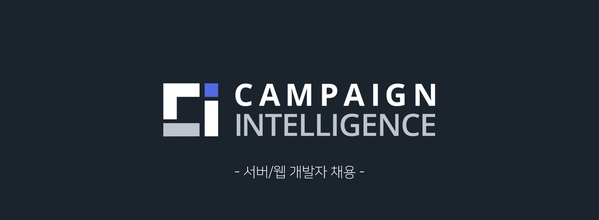
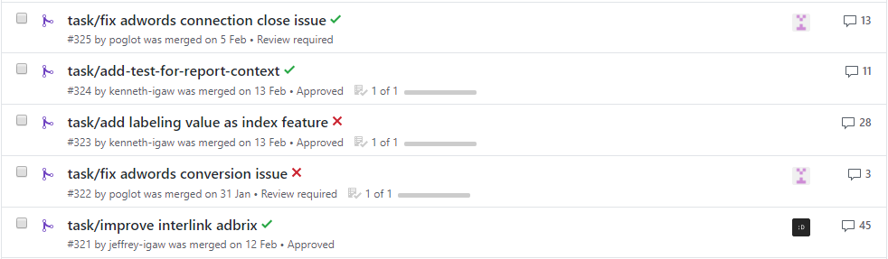
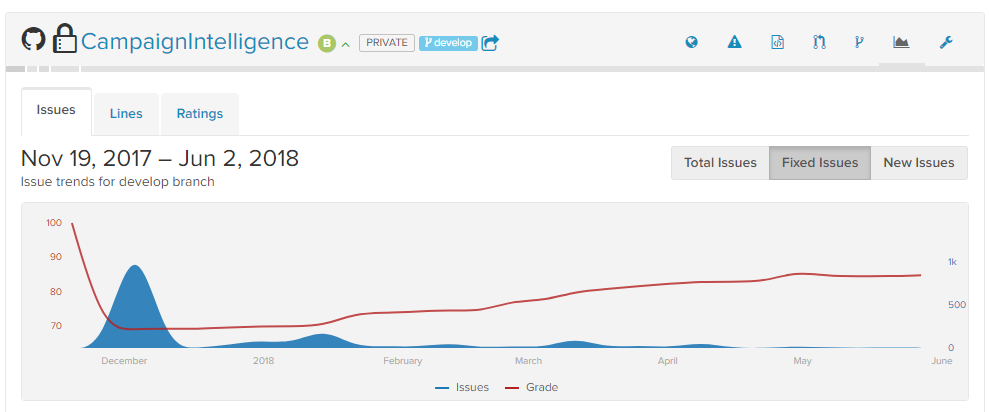
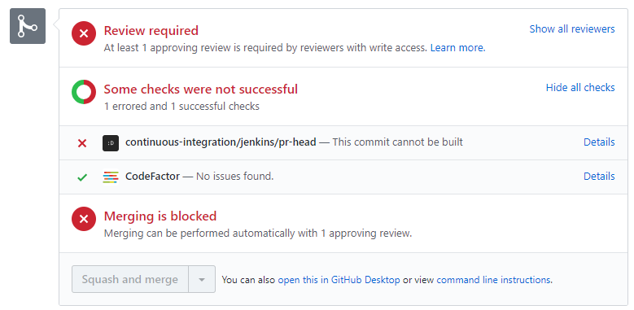

## Campaign Intelligence 개발자를 구합니다!

AdTech 분야의 중심점, **Campaign Intelligence** 팀에서 서버/웹 개발자를 채용합니다!

### 무엇을 하는 팀인가요?

안녕하세요! IGAWorks의 [Campaign Intelligence](https://c-intelligence.com/main)는 매체 리포팅, 어트리뷰션 등의 수많은 벤더에서 제공하는 데이터를 정제/가공하여 고객사에게 애드테크 업계의 심도 있는 인사이트를 제공하는 팀입니다. 

### 어떻게 일하나요?

직책과 나이/성별에 무관하게 상호 존중 및 의견 교류를 통해 업무를 진행합니다. 새로운 동료라도 회의를 개설하고 겪고 있는 문제에 대해 의견을 묻는 것이 당연한 팀입니다. 개발/사업팀 모두 서로를 이해하려 노력하는 문화가 갖춰져 있습니다. 결코 독단적인 결정을 통해 업무를 진행하지 않습니다.

우리는 코드리뷰 문화를 가지고 있습니다. PR에는 작업한 코드에 충분한 설명을 첨부하며, 리뷰어는 코드를 이해하고 개선점이 없는지 생각합니다. 많은 의견이 오고 가는 일도 빈번하며 PR이 쉽사리 통과되지 않을 때도 있지만, 우리는 이를 통해 잠재적인 결함을 찾고 개선해 나가는 과정을 경험하고 있습니다.

(좋은 코드리뷰 문화를 가지려고 노력하고 있습니다.)

(Todo 어떤 말로 시작하는 게 좋을까요?) 대부분의 업무는 상호 검토를 통해 진행되기에 팀에는 개인의 잘못은 존재하지 않습니다. 또한 실수가 발생하더라도 이는 자동화된 시스템의 부재에서 왔다고 생각합니다. 따라서 일감에 대한 세심한 검토와 자동화된 배포/테스트를 지속적으로 구축하고 관리하여 이러한 실수를 최대한 억제하려고 노력합니다.

(더불어 코드 퀄티리에 대한 관심도 높습니다.)

(자동화된 장치들을 도입 중에 있습니다. :wink:)

자율적입니다. 위와 같은 문화를 통해 동료 간 신뢰가 두텁습니다. 어떠한 일감에 대해서 담당자에 대해 완전히 믿고 맡깁니다. 또한 동료의 의견이라면 적극적으로 검토하여 수렴합니다. 무수한 일감 중에서 자신이 할 일을 혹은 하고 싶은 일을 먼저 선택하여 가져가는 팀입니다.

주기적으로 스프린트를 진행하며 단계별로 개선/확장해나가고 있습니다. 아직은 완벽하지 않기에 점차적으로 자체적인 룰을 만들어서 개선하고 있습니다. 릴리즈 프로세스를 지키려 노력하며 일감의 우선순위는 팀원들 간의 의사소통 후 결정합니다.

### 우리는 이런 사람을 원합니다.

- 스스로 일을 주도적으로 진행할 수 있는 분
- 회의 시간에 어떠한 의견이라도 말하지 못하면 못 배기는 분
- 궁금한 점에 대해서 적극적으로 물어보는 분
- 자신의 주관을 타인에게 설득하려 노력하는 분
- 담당된 일감이 아니더라도 제품에 대해서 관심이 깊은 분
- 개인보단 동료, 팀을 위해서 일할 준비가 되어있으신 분

### 지금은 이런 고민을 하고 있어요.

짧은 개발기간과 새로운 비즈니스를 하며 쌓인 기술 부채들을 하나씩 제거하고 있습니다. 전 단계를 통해 제품에 대한 시장의 니즈가 있다는 것은 확신하고 있습니다만 지금까지 쌓여온 다양한 문제를을 어떻게 효율적으로 해결할 것인지에 대한 고민에 있습니다. 동적 통계 쿼리 부분을 리팩토링해야하며 데이터 스토어를 더욱 빠르게 안정적으로 관리할 수 있는 방법을 고민 중입니다. 이런 부분들을 도와주실 수 있으면 정말 좋을 것 같습니다.

### 기술 스택

- XUnit, Moq, MockHttp등을 통해서 테스트를 작성합니다.
- IoC/DI컨테이너에 대해서 사용경험이 있으시면 좋아요.
- AWS Redshift, Elastic Beanstalk, SQS, ElastiCache, Aurora, SES, ECS, ECR, SMS, Lambda 등을 사용해요!
- Front-End는 Typescript와 Angular 5를 사용합니다. 타입시스템이 없으면 이젠 버티지 못할 것 같아요.
- Back-End는 모던 C#(7.2)와 NodeJS를 사용하지만 서비스의 분리를 통해 Kotlin, Scala를 사용할 준비는 되어있어요!
- Jenkins를 통해 자동화된 빌드/테스트를 진행하고 있어요, 배포 프로세스는 현재 테스트중입니다!
- Docker, ECS, SQS를 통해 많은 데이터를 수집하고 처리하는 부분을 만들고 있어요.
- Hadoop(EMR), Impala를 통해서 데이터 리포팅부분을 점차적으로 개선할 예정이예요.
- Jira, Confluence, Slack, Git기반의 workflow를 구성하여 일하고 있어요.

### 우대사항

위 기술 스택에 대한 경험이 있으면 최고이지만, 정말 배움에 대한 열정이 대단하신 분이면 좋을 것 같아요. 매일 자신에게 도전해보고 싶지 않으신가요? 혹은 동료간 싶은 유대감과 신뢰를 통해 멋진 제품을 만들고 싶으신가요? 그럼 지원해주세요!

### 근로 및 복지

- 위치 : 서울특별시 상암동 상암산로 48-6, 9층 IGAWorks
- 근무시간 : 09:30 ~ 18:30
  - 야근(오후 10시 이후 퇴근), 저녁 식대와 다음날 지연 출근(10시 30분)을 제공해요.
  - 대중교통이 끊기셨다면 교통비를 제공해요.
  - 철야시 다음날 오후 출근(2시 30분)하시면 되요.
- 바디프렌드가 있어요! 작지만 피로를 풀기엔 괜찮은 것 같아요.
- 음료/캡슐커피(네스프레소)가 무제한이예요.
- 오전 11시까지 토스트도 제공해요.
- 개발 서적 구매도 지원합니다.
- 사내 동호회도 운영합니다.
- MPN(Visual Studio)를 기본적으로 제공하고 필요에 따라 Jetbrains제품군도 사용하실 수 있어요.

### 채용 프로세스는 어떻게 되나요?

1. 서류 제출
1. 코딩 테스트
1. 기술 면접
1. 임원 면접 

### 마지막으로...

만약 우리팀에 대해서 더 궁금하신 점이 있다면 ci@igaworks.com으로 메일주시면 됩니다!